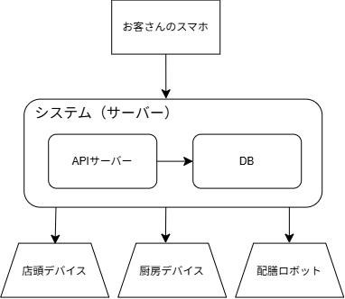
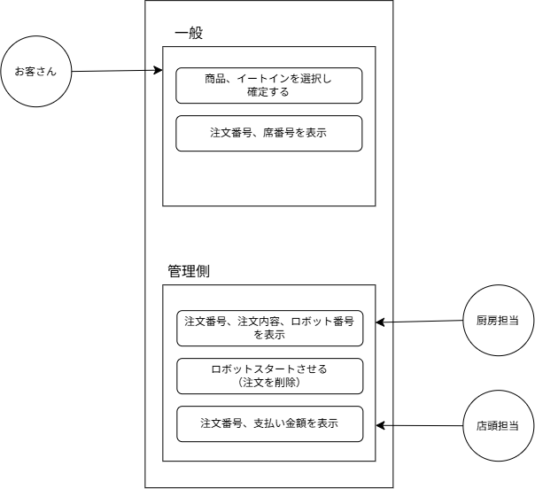

# しよーしょ_注文システム

## システム概要
高専祭の出店で制御感を出すために、お客さんのスマートフォンから注文できるWebアプリケーションを開発する。
注文内容は厨房、配膳ロボットに共有され、配膳ロボは注文された料理を指定されたテーブルまで運搬できるようにする。

## システム構成

## システムの流れ
1.	お客さんが店頭のQRを読み取り、Webアプリへアクセスする。
2.	商品一覧から注文したい商品を選択する。
3.	イートインかテイクアウトかを選択。イートインの場合、人数を入力する。
4.	注文を確定する。
5.  注文情報、席情報をサーバーに送信する。
6.  お客さんのスマホに「注文番号、（イートインなら）席情報」を表示する。
「注文情報」を店頭、厨房デバイスに表示する。
7.  お客さんのデバイスに注文番号より、支払いをする。
    厨房は届いた内容を元に調理後、配膳。状況ステータスを完了にする。
8.  お客さんのデバイスにもうすぐ来ることを表示。
9.  退室前に退室ボタンを押す。

## ユースケース

##　機能
（お客さん）
- 注文を選択する。
- イートインかテイクアウトかを選択。イートインの場合、人数を入力。
- 「注文番号、（イートインなら）席番号」を表示する。

（店頭）
- 「注文番号、支払い金額、注文内容」を表示する

（厨房）
- 「注文番号、注文内容、ロボット番号」を表示する
- ロボットをスタートさせる（注文を完了ステータスにする）

（システム）
- 注文情報を管理する
- 席情報を管理する
- イートインの場合は席を指定する

## 画面遷移
（お客さん）
商品、イートイン選択→注文を確認し確定→「注文番号、席番号」を表示する

（店頭）
「注文番号、支払い金額、注文内容」を表示する

（厨房）
「注文番号、注文内容、ロボット番号」を表示する

## 要素技術
- フロントエンド：HTML/CSS/JavaScript
- バックエンド：Python
- データベース：MySQL
- QRコード
- サーバー

## 大まかな開発計画
- 8月：仕様や画面設計を確定させる
　　　Ver.1:注文を入力、保存できるようにする
　　　Ver.2:席管理ができるようにする
　　　Ver.3:店頭や厨房でも確認できるようにする
- 9月：Ver.4:ロボットに通信できるようにする
　　　Ver.5:不具合確認、最終テスト
- 10月：完成
